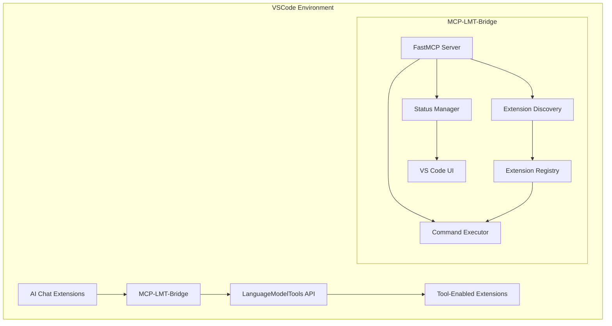
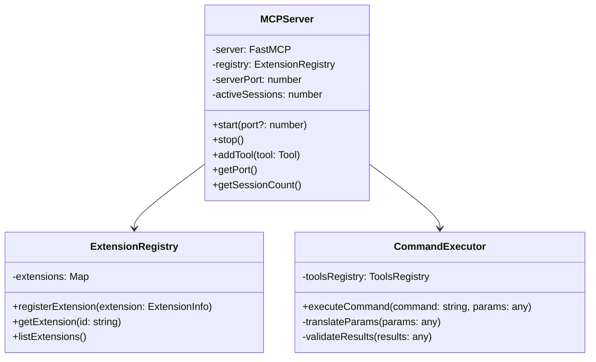
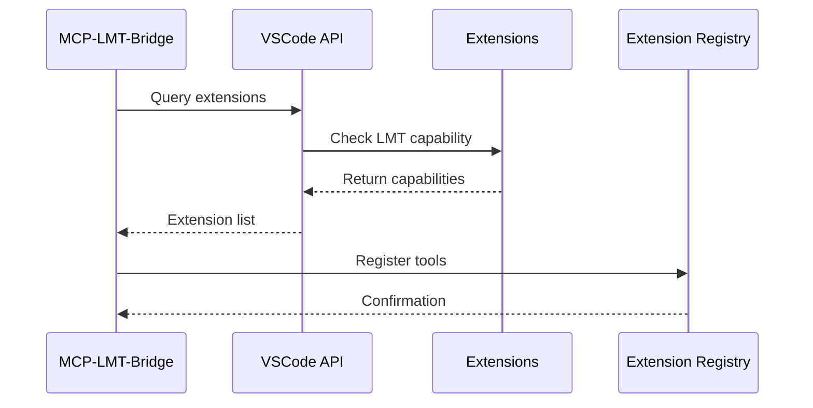
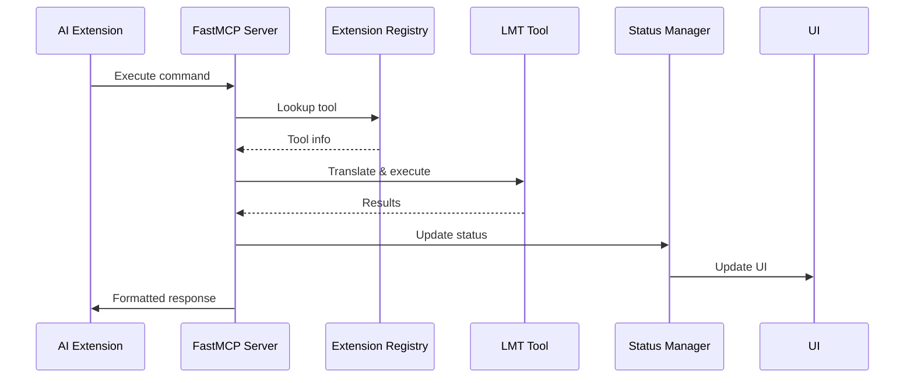
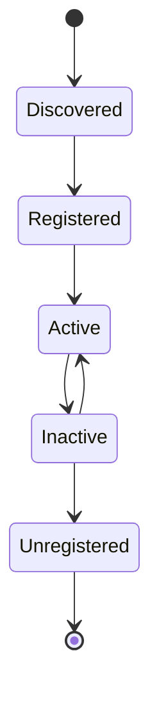
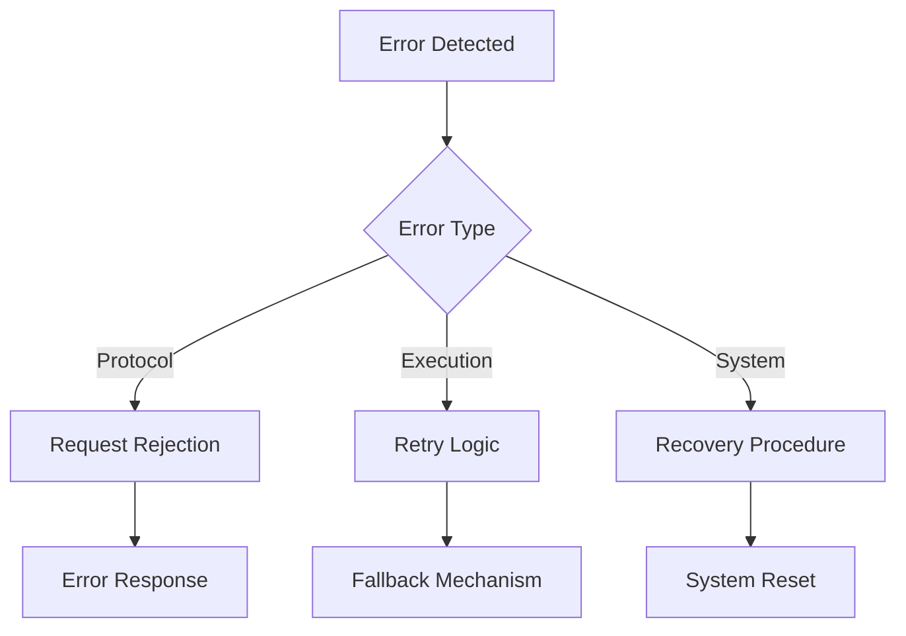

# MCP-LMT-Bridge Architecture Design Document

## Table of Contents
- [1. System Overview](#1-system-overview)
- [2. Core Components](#2-core-components)
- [3. Interaction Flows](#3-interaction-flows)
- [4. Technical Specifications](#4-technical-specifications)
- [5. Security Architecture](#5-security-architecture)
- [6. Error Handling](#6-error-handling)
- [7. Performance Considerations](#7-performance-considerations)
- [8. Implementation Guidelines](#8-implementation-guidelines)

## 1. System Overview

The MCP-LMT-Bridge serves as a crucial middleware component in VSCode, enabling communication between MCP-capable AI chat extensions and extensions implementing the LanguageModelTools API.

### 1.1 High-Level Architecture



### 1.2 Key Design Principles

1. **Modularity**: Loose coupling between components for maintainability
2. **Extensibility**: Easy integration of new tools and capabilities
3. **Reliability**: Robust error handling and recovery mechanisms
4. **Performance**: Optimized for real-time command execution
5. **Security**: Strict validation and permission controls

## 2. Core Components

### 2.1 MCP Server Implementation



#### Key Components:

1. **Server Core**
   - Protocol implementation
   - Request/response handling
   - Session management
   - WebSocket connection handling

2. **Request Processor**
   - Command parsing
   - Parameter validation
   - Response formatting
   - Error handling

### 2.2 Extension Discovery System



#### Components:

1. **Extension Scanner**
   - Periodic scanning for new extensions
   - Capability detection
   - Version compatibility checking

2. **Registry Manager**
   - Tool indexing
   - Capability mapping
   - Configuration management

### 2.3 Command Integration

```typescript
interface CommandDefinition {
    id: string;
    toolId: string;
    parameters: ParameterDefinition[];
    returns: ReturnTypeDefinition;
    capabilities: string[];
}

interface ToolMapping {
    commandId: string;
    extensionId: string;
    toolName: string;
    parameterMap: Map<string, string>;
}
```

## 3. Interaction Flows

### 3.1 Command Execution Flow



### 3.2 Extension Lifecycle



## 4. Technical Specifications

### 4.1 Extension Manifest

```json
{
    "contributes": {
        "mcp-lmt-bridge": {
            "tools": [{
                "id": "example.tool",
                "name": "Example Tool",
                "description": "Tool description",
                "parameters": [{
                    "name": "param1",
                    "type": "string",
                    "required": true
                }]
            }]
        }
    }
}
```

### 4.2 API Interfaces

```typescript
interface MCPToolProvider {
    getTools(): Tool[];
    executeTool(id: string, params: any): Promise<any>;
}

interface LMTBridgeAPI {
    registerProvider(provider: MCPToolProvider): void;
    unregisterProvider(providerId: string): void;
}
```

## 5. Security Architecture

### 5.1 Security Measures

1. **Request Validation**
   - Input sanitization
   - Parameter type checking
   - Permission verification

2. **Extension Isolation**
   - Sandboxed execution
   - Resource limitations
   - Capability restrictions

3. **Access Control**
   - Tool-level permissions
   - Extension authentication
   - Command authorization

## 6. Error Handling

### 6.1 Error Categories

1. **Protocol Errors**
   - Invalid requests
   - Protocol violations
   - Version mismatches

2. **Execution Errors**
   - Tool failures
   - Parameter errors
   - Resource constraints

3. **System Errors**
   - Extension crashes
   - Communication failures
   - Resource exhaustion

### 6.2 Recovery Strategies



## 7. Performance Considerations

### 7.1 Optimization Strategies

1. **Command Execution**
   - Request queuing
   - Parallel processing
   - Result caching

2. **Resource Management**
   - Memory pooling
   - Connection pooling
   - Thread management

3. **Response Optimization**
   - Payload compression
   - Batch processing
   - Incremental updates

## 8. Implementation Guidelines

### 8.1 Development Workflow

1. **Setup**
   - Install dependencies
   - Configure development environment
   - Setup testing framework

2. **Implementation**
   - Follow VSCode extension guidelines
   - Implement core components
   - Add error handling
   - Include logging

3. **Testing**
   - Unit tests
   - Integration tests
   - Performance testing
   - Security testing

### 8.2 Coding Standards

1. **TypeScript Best Practices**
   - Strong typing
   - Interface-driven development
   - Async/await patterns
   - Error handling

2. **Documentation**
   - JSDoc comments
   - API documentation
   - Usage examples
   - Troubleshooting guides