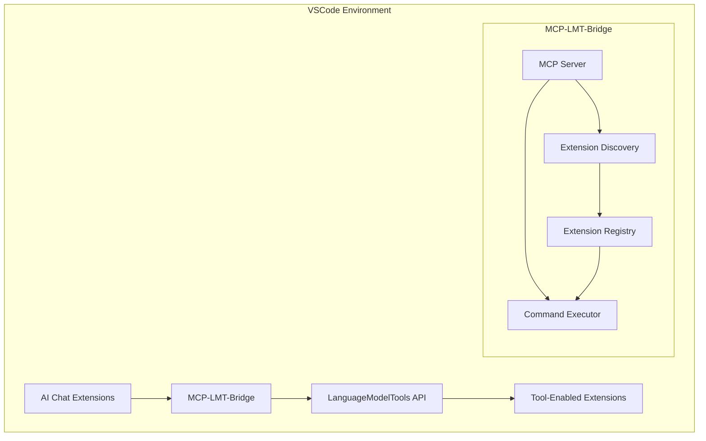

# MCP-LMT-Bridge Documentation

## Table of Contents
- [Installation Guide](#installation-guide)
- [User Guide](#user-guide)
- [API Reference](#api-reference)
- [Developer Guide](#developer-guide)
- [Troubleshooting](#troubleshooting)

## Installation Guide

### Prerequisites
- Visual Studio Code ^1.85.0 or higher
- Node.js ^22.14.0
- npm or yarn package manager

### Installation Steps

#### From VS Code Marketplace (Not yet available)
1. Open Visual Studio Code
2. Go to the Extensions view (`Ctrl+Shift+X` or `Cmd+Shift+X`)
3. Search for "MCP-LMT-Bridge"
4. Click Install
5. Reload VSCode when prompted

#### From VSIX File (Development)

1. Clone the repository:

```bash
git clone https://github.com/username/mcp-lmt-bridge.git
cd mcp-lmt-bridge
```

2. Install dependencies and build:

```bash
npm install
npm run clean
npm run compile
npm run package:vsix
```

3. Install the extension:

```bash
code --install-extension mcp-lmt-bridge-0.1.0.vsix
```

4. Verify installation:

```bash
code --list-extensions --show-versions | grep mcp-lmt-bridge
```

5. If the extension is not visible, check the troubleshooting guide for solutions.

### Configuration

Create or modify `.vscode/settings.json` in your workspace:

```json
{
    "mcp-lmt-bridge": {
        "serverPort": 3000,
        "trace.server": "off" | "messages" | "verbose",
        "logLevel": "error" | "warn" | "info" | "debug"
    }
}
```

## User Guide

### Basic Usage

1. **Opening the Command Palette**
    - Press `Ctrl+Shift+P` (Windows/Linux) or `Cmd+Shift+P` (macOS)
    - The Command Palette will appear at the top of the VS Code window

2. **Available Commands**
    Type "MCP" in the Command Palette to see available commands:

    - `MCP-LMT: List Extensions` - Lists all available MCP-enabled extensions
    - `MCP-LMT: Get Tool Info` - Shows information about a specific tool
    - `MCP-LMT: Execute Tool` - Runs a specified MCP tool

3. **Using the Commands**
    a. List Extensions:
    - Open Command Palette
    - Type `MCP-LMT: List Extensions`
    - Press Enter to see available extensions

    b. Get Tool Info:
    - Open Command Palette
    - Type `MCP-LMT: Get Tool Info`
    - Select or enter the extension ID when prompted

    c. Execute Tool:
    - Open Command Palette
    - Type `MCP-LMT: Execute Tool`
    - Follow the prompts to select tool and enter parameters

4. **Programmatic Usage**
    For extension developers:

```typescript
// List extensions
const extensions = await vscode.commands.executeCommand('mcp.lmt.listExtensions');

// Get tool info
const toolInfo = await vscode.commands.executeCommand('mcp.lmt.getToolInfo', 'example.tool');

// Execute tool
const result = await vscode.commands.executeCommand('mcp.lmt.executeTool', {
    toolId: 'example.tool',
    params: { param1: 'value' }
});
```

### Common Operations

#### Discovering Tools

```typescript
const extensions = await vscode.commands.executeCommand('mcp.lmt.listExtensions');
```

#### Tool Execution

```typescript
const response = await vscode.commands.executeCommand('mcp.lmt.executeTool', {
    toolId: 'example.tool',
    params: {
        input: 'test',
        options: { flag: true }
    }
});
```

## API Reference

### MCP Commands

1. `mcp.lmt.listExtensions`
    - Lists all LanguageModelTools-compatible extensions
    - Returns: `Extension[]`

2. `mcp.lmt.getToolInfo`
    - Parameters: `toolId: string`
    - Returns: Detailed tool information

3. `mcp.lmt.executeTool`
    - Parameters: `{ toolId: string, params: any }`
    - Returns: Tool execution results

### Tool Provider Interface

```typescript
interface MCPToolProvider {
    getTools(): Tool[];
    executeTool(id: string, params: any): Promise<any>;
}

interface Tool {
    id: string;
    name: string;
    description: string;
    parameters: ParameterDefinition[];
}

interface ParameterDefinition {
    name: string;
    type: string;
    required: boolean;
    description?: string;
}
```

### Response Formats

Success Response:

```json
{
    "status": "success",
    "data": {
        "result": "Operation completed",
        "metadata": {}
    }
}
```

Error Response:

```json
{
    "status": "error",
    "error": {
        "code": "INVALID_PARAMS",
        "message": "Invalid parameters provided",
        "details": {}
    }
}
```

## Developer Guide

### Project Setup

1. Clone the repository:

```bash
git clone https://github.com/username/mcp-lmt-bridge.git
cd mcp-lmt-bridge
```

2. Install dependencies:

```bash
npm install
```

3. Build the extension:

```bash
npm run compile
# or for production build:
npm run package
```

### Architecture Overview



### Testing Guidelines

1. **Unit Tests**

```bash
npm run test:unit
```

2. **Integration Tests**

```bash
npm run test:integration
```

3. **Test Coverage**

```bash
npm run test:coverage
```

### Contributing Guidelines

1. Fork the repository
2. Create a feature branch
3. Follow TypeScript best practices
4. Include tests for new features
5. Update documentation
6. Submit a pull request

## Troubleshooting

### Common Issues

1. **Connection Errors**
    - Verify server port configuration
    - Check firewall settings
    - Ensure no port conflicts

2. **Tool Execution Failures**
    - Validate parameter types
    - Check tool availability
    - Review error logs

3. **Performance Issues**
    - Monitor memory usage
    - Check connection pooling
    - Review active connections

### Error Codes

| Code           | Description         | Resolution            |
|----------------|--------------------|-----------------------|
| `CONN_REFUSED` | Connection refused | Check server status   |
| `INVALID_PARAMS`| Invalid parameters | Validate input format |
| `TOOL_NOT_FOUND`| Tool not available | Verify tool ID        |
| `AUTH_FAILED`  | Authentication failed| Check credentials    |

### Logging

Enable debug logging in `.vscode/settings.json`:

```json
{
    "mcp-lmt-bridge.trace.server": "verbose",
    "mcp-lmt-bridge.logLevel": "debug"
}
```

