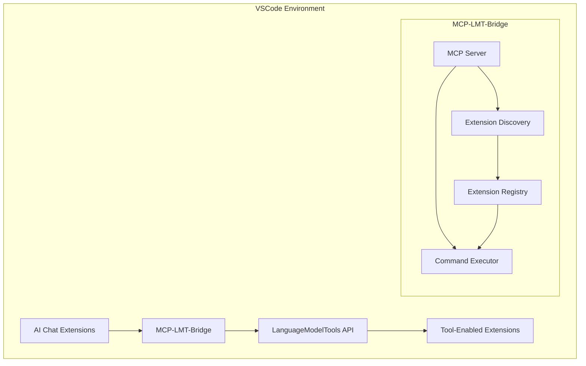

# MCP-LMT-Bridge Documentation

## Table of Contents
- [Installation Guide](#installation-guide)
- [User Guide](#user-guide)
- [API Reference](#api-reference)
- [Developer Guide](#developer-guide)
- [Troubleshooting](#troubleshooting)

## Installation Guide

### Prerequisites
- Visual Studio Code 1.85.0 or higher
- Node.js 16+
- npm or yarn package manager

### Installation Steps
1. Open Visual Studio Code
2. Go to the Extensions view (`Ctrl+Shift+X` or `Cmd+Shift+X`)
3. Search for "MCP-LMT-Bridge"
4. Click Install
5. Reload VSCode when prompted

### Configuration
Create or modify `.vscode/settings.json` in your workspace:

```json
{
    "mcp-lmt-bridge": {
        "serverPort": 3000,
        "logLevel": "info",
        "maxConnections": 10
    }
}
```

## User Guide

### Basic Usage

1. **Accessing MCP Tools**
   ```bash
   # List available tools
   > mcp.lmt.listExtensions
   
   # Get tool details
   > mcp.lmt.getToolInfo example.tool
   ```

2. **Executing Commands**
   ```typescript
   // Example command execution
   const result = await vscode.commands.executeCommand('mcp.lmt.executeTool', {
       toolId: 'example.tool',
       params: { param1: 'value' }
   });
   ```

### Common Operations

#### Discovering Tools
```typescript
const extensions = await vscode.commands.executeCommand('mcp.lmt.listExtensions');
```

#### Tool Execution
```typescript
const response = await vscode.commands.executeCommand('mcp.lmt.executeTool', {
    toolId: 'example.tool',
    params: {
        input: 'test',
        options: { flag: true }
    }
});
```

## API Reference

### MCP Commands

1. `mcp.lmt.listExtensions`
   - Lists all LanguageModelTools-compatible extensions
   - Returns: `Extension[]`

2. `mcp.lmt.getToolInfo`
   - Parameters: `toolId: string`
   - Returns: Detailed tool information

3. `mcp.lmt.executeTool`
   - Parameters: `{ toolId: string, params: any }`
   - Returns: Tool execution results

### Tool Provider Interface

```typescript
interface MCPToolProvider {
    getTools(): Tool[];
    executeTool(id: string, params: any): Promise<any>;
}

interface Tool {
    id: string;
    name: string;
    description: string;
    parameters: ParameterDefinition[];
}

interface ParameterDefinition {
    name: string;
    type: string;
    required: boolean;
    description?: string;
}
```

### Response Formats

Success Response:
```json
{
    "status": "success",
    "data": {
        "result": "Operation completed",
        "metadata": {}
    }
}
```

Error Response:
```json
{
    "status": "error",
    "error": {
        "code": "INVALID_PARAMS",
        "message": "Invalid parameters provided",
        "details": {}
    }
}
```

## Developer Guide

### Project Setup

1. Clone the repository:
   ```bash
   git clone https://github.com/org/mcp-lmt-bridge.git
   cd mcp-lmt-bridge
   ```

2. Install dependencies:
   ```bash
   npm install
   ```

3. Build the extension:
   ```bash
   npm run build
   ```

### Architecture Overview



### Testing Guidelines

1. **Unit Tests**
   ```bash
   npm run test:unit
   ```

2. **Integration Tests**
   ```bash
   npm run test:integration
   ```

3. **Test Coverage**
   ```bash
   npm run test:coverage
   ```

### Contributing Guidelines

1. Fork the repository
2. Create a feature branch
3. Follow TypeScript best practices
4. Include tests for new features
5. Update documentation
6. Submit a pull request

## Troubleshooting

### Common Issues

1. **Connection Errors**
   - Verify server port configuration
   - Check firewall settings
   - Ensure no port conflicts

2. **Tool Execution Failures**
   - Validate parameter types
   - Check tool availability
   - Review error logs

3. **Performance Issues**
   - Monitor memory usage
   - Check connection pooling
   - Review active connections

### Error Codes

| Code | Description | Resolution |
|------|-------------|------------|
| `CONN_REFUSED` | Connection refused | Check server status |
| `INVALID_PARAMS` | Invalid parameters | Validate input format |
| `TOOL_NOT_FOUND` | Tool not available | Verify tool ID |
| `AUTH_FAILED` | Authentication failed | Check credentials |

### Logging

Enable debug logging in `.vscode/settings.json`:
```json
{
    "mcp-lmt-bridge.trace.server": "verbose",
    "mcp-lmt-bridge.logLevel": "debug"
}
```

For additional support, file issues on the GitHub repository or contact the development team.