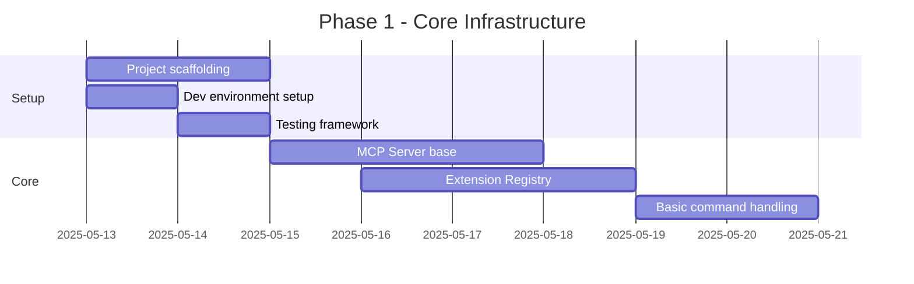
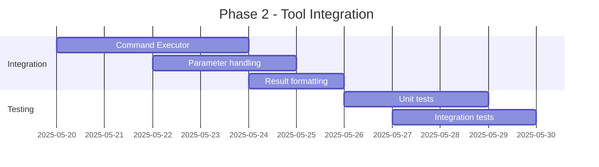
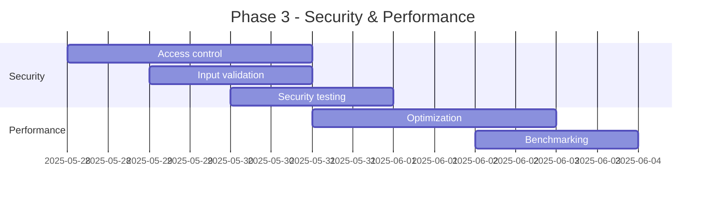
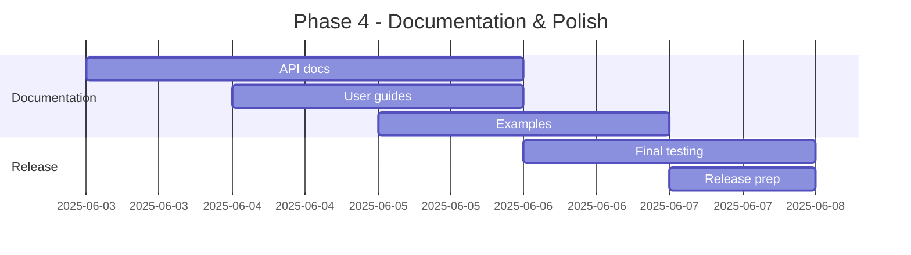

# MCP-LMT-Bridge Implementation Plan

## Overview

This document outlines the phased implementation approach for the MCP-LMT-Bridge VSCode extension. The implementation is structured into distinct phases to ensure systematic development and testing of each component.

## Phase 1: Core Infrastructure (Week 1-2)

### Tasks

1. **Project Setup**
   - [ ] Initialize VSCode extension project
   - [ ] Configure TypeScript and build pipeline
   - [ ] Set up testing framework (Jest)
   - [ ] Configure linting and code formatting
   - [ ] Set up CI/CD pipeline

2. **MCP Server Implementation**
   - [ ] Implement basic server structure
   - [ ] Add WebSocket connection handling
   - [ ] Implement protocol message parsing
   - [ ] Add session management

3. **Extension Registry Foundation**
   - [ ] Create extension discovery system
   - [ ] Implement registry storage
   - [ ] Add basic CRUD operations
   - [ ] Implement event system

## Phase 2: Tool Integration (Week 3-4)

### Tasks

1. **Command Executor**
   - [ ] Implement command validation
   - [ ] Create parameter translation system
   - [ ] Add result handling
   - [ ] Implement error handling

2. **Tool Integration**
   - [ ] Implement tool discovery
   - [ ] Add capability mapping
   - [ ] Create parameter validation
   - [ ] Add response formatting

3. **Testing Infrastructure**
   - [ ] Create unit test suite
   - [ ] Add integration tests
   - [ ] Implement mock tools
   - [ ] Add performance tests

## Phase 3: Security & Performance (Week 5)

### Tasks

1. **Security Implementation**
   - [ ] Add request validation
   - [ ] Implement access control
   - [ ] Add security logging
   - [ ] Implement rate limiting

2. **Performance Optimization**
   - [ ] Add request queuing
   - [ ] Implement caching
   - [ ] Add connection pooling
   - [ ] Optimize resource usage

3. **Testing & Validation**
   - [ ] Security testing
   - [ ] Performance benchmarking
   - [ ] Load testing
   - [ ] Vulnerability scanning

## Phase 4: Documentation & Polish (Week 6)

### Tasks

1. **Documentation**
   - [ ] Write API documentation
   - [ ] Create user guides
   - [ ] Add code examples
   - [ ] Write troubleshooting guide

2. **Final Polish**
   - [ ] Code cleanup
   - [ ] Final performance tuning
   - [ ] Error message refinement
   - [ ] UI/UX improvements

3. **Release Preparation**
   - [ ] Version compatibility testing
   - [ ] Create release notes
   - [ ] Prepare distribution package
   - [ ] Final security audit

## Dependencies & Prerequisites

1. Development Environment:
   - Node.js 16+
   - VSCode 1.85.0+
   - TypeScript 4.9+
   - Jest testing framework
   - ESLint + Prettier

2. Required APIs:
   - VSCode Extension API
   - LanguageModelTools API
   - WebSocket API

3. External Tools:
   - Git
   - npm/yarn
   - VSCode Extension CLI

## Success Criteria

1. **Functionality**
   - All core features implemented and tested
   - Successful integration with MCP and LMT APIs
   - Error handling and recovery working as designed

2. **Performance**
   - Command execution < 100ms
   - Memory usage < 50MB
   - CPU usage < 5% during idle

3. **Quality**
   - Test coverage > 80%
   - Zero critical security issues
   - All major browsers supported

## Risk Management

1. **Technical Risks**
   - API compatibility issues
   - Performance bottlenecks
   - Security vulnerabilities

2. **Mitigation Strategies**
   - Regular testing with different VSCode versions
   - Performance monitoring and optimization
   - Security audits and penetration testing

## Next Steps

1. Begin Phase 1 implementation:
   - Set up development environment
   - Initialize project structure
   - Implement core MCP server

2. Regular progress tracking:
   - Daily code reviews
   - Weekly progress meetings
   - Continuous integration testing

3. Documentation updates:
   - Keep API documentation current
   - Update implementation notes
   - Maintain change log