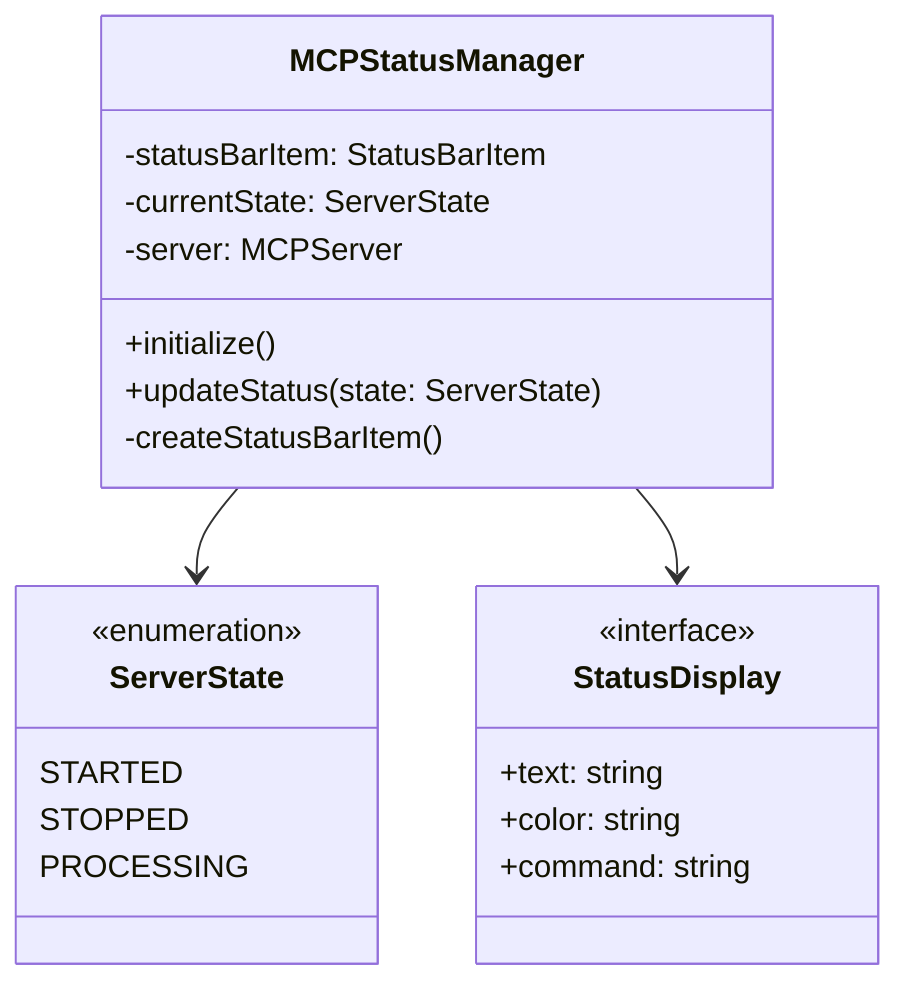

# MCP Server Status Indicator Implementation Plan

## Overview

This document outlines the implementation plan for adding a status bar indicator to display real-time MCP server status in VSCode.

## 1. Component Structure

### 1.1 New Components



1. `MCPStatusManager` class
   - Manages status bar item lifecycle
   - Handles state transitions
   - Updates visual representation

### 1.2 Integration Points
1. `MCPServer` class modifications
   - Add status notification events
   - Integrate processing state tracking
   - Add status manager initialization

## 2. Technical Details

### 2.1 Status States
```typescript
enum ServerState {
    STARTED = 'started',
    STOPPED = 'stopped',
    PROCESSING = 'processing'
}
```

### 2.2 Visual Representation
1. Started
   - Text: "$(rocket) MCP Server: Running"
   - Color: statusBar.foreground
   - Command: 'mcp-lmt-bridge.showServerInfo'

2. Stopped
   - Text: "$(stop) MCP Server: Stopped"
   - Color: statusBar.errorForeground
   - Command: 'mcp-lmt-bridge.startServer'

3. Processing
   - Text: "$(sync~spin) MCP Server: Processing"
   - Color: statusBar.foreground
   - Command: 'mcp-lmt-bridge.showActiveRequests'

### 2.3 State Management
1. Track server state in MCPServer class
2. Emit state change events
3. Update status bar based on events

## 3. Implementation Steps

1. Create Status Manager
```typescript
// Create new file: src/status/mcpStatusManager.ts
export class MCPStatusManager {
    private statusBarItem: vscode.StatusBarItem;
    private currentState: ServerState;
    
    constructor(server: MCPServer) {
        this.initialize();
        this.listenToServerEvents(server);
    }
}
```

2. Modify MCPServer
```typescript
// Add to src/server/mcpServer.ts
export class MCPServer {
    private statusManager: MCPStatusManager;
    
    public async start(): Promise<void> {
        // Existing start code...
        this.emit('stateChanged', ServerState.STARTED);
    }
}
```

3. Add Event Handling
```typescript
// Add to src/server/mcpServer.ts
private handleRequest(): Promise<MCPResponse> {
    this.emit('stateChanged', ServerState.PROCESSING);
    try {
        // Existing request handling...
    } finally {
        this.emit('stateChanged', ServerState.STARTED);
    }
}
```

4. Update Extension Activation
```typescript
// Modify src/extension.ts
export function activate(context: vscode.ExtensionContext) {
    const server = new MCPServer();
    const statusManager = new MCPStatusManager(server);
    
    context.subscriptions.push(statusManager);
}
```

## 4. Testing Strategy

1. Unit Tests
   - Test state transitions
   - Verify status bar updates
   - Mock server events

2. Integration Tests
   - Test full state cycle
   - Verify visual updates
   - Test command integration

## 5. Error Handling

1. Server Failures
   - Automatically update status to STOPPED
   - Show error message in status bar
   - Provide restart option

2. State Transition Errors
   - Maintain last known good state
   - Log transition failures
   - Implement recovery mechanism

## 6. Performance Considerations

1. Status Updates
   - Debounce rapid state changes
   - Batch visual updates
   - Optimize event handling

2. Resource Usage
   - Minimize memory footprint
   - Clean up event listeners
   - Handle disposables properly